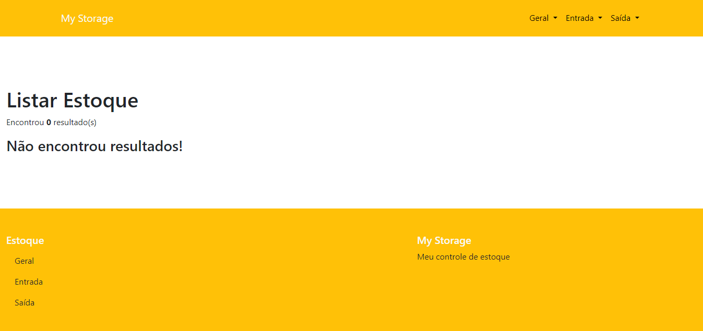

<h1 align="center">MYSTORAGE</h1> 
<h2 align="center">Projeto Integrador Transdisciplinar em Ciência da Computação - Cruzeiro do Sul  | Mateus Canjerana</h2>
</rh>

  

</rh>
<h2 align="center">Sobre</h2>

  <h3>My Storage é um sistema de controle de estoque compacto que tem como objetivo gerenciar seus produtos. Além de salvar as informações dos produtos (Nome e Quantidade) também é um sistema que trata o controle de entrada e saída, salvando a quantidade já calculada na tabela geral dos itens adicionados ou retirados de seu estoque!</h3>

 
</rh>
<h2 align="center">Para acessar esse projeto e vizualizar na pratica deve-se seguir alguns passos:</h2>

  <h3>Primeiro:</h4>
  <h4>Instale o "XAMPP" em sua maquina</h4>

  <h3>Segundo:</h4>
  <h4>Ative o APACHE & MYSQL no painel de controle do XAMPP</h4>

  <h3>Terceiro:</h4>
  <h4>Acesse o Banco de Dados digitando "localhost/phpmyadmin" em seu Browser</h4>

  <h3>Quarto:</h4>
  <h4>Baixe o conteúdo desse repositório e o salve em "C:\xampp\htdocs"</h4>

  <h3>Quinto:</h4>
  <h4>Abra o arquivo "mystorage.sql" na pasta "docs" desse repositório e copie seu conteúdo</h4>

  <h3>Sexto:</h4>
  <h4>Voltando ao seu Browser, crie um Banco de Dados chamado "mystorage", clique na opção "SQL" e cole o conteúdo que você copiou anteriormente</h4>

  <h3>Setimo:</h4>
  <h4>Em outra aba de seu Browser digite "localhost/mystorage" e assim acessará o sistema</h4>

